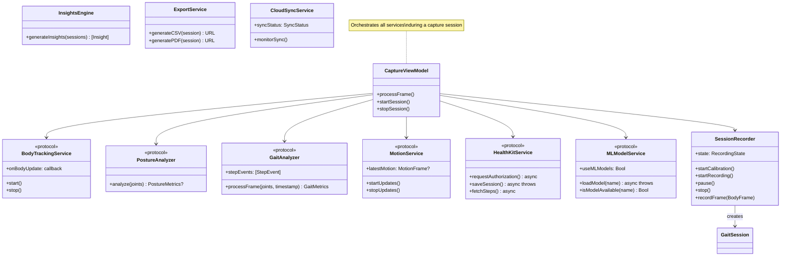

# Andernet Posture — Architecture

This document provides a comprehensive architectural overview of the Andernet Posture application using Mermaid diagrams. Each section covers a distinct layer or concern of the system.

> **Rendering:** GitHub natively renders Mermaid blocks in Markdown. If viewing locally, use a Mermaid-compatible viewer or the [Mermaid Live Editor](https://mermaid.live).

---

## Table of Contents

1. [High-Level System Overview](#1-high-level-system-overview)
2. [MVVM Architecture](#2-mvvm-architecture)
3. [Real-Time Data Flow Pipeline](#3-real-time-data-flow-pipeline)
4. [Service Layer](#4-service-layer)
5. [Clinical Analysis Engine](#5-clinical-analysis-engine)
6. [CoreML Pipeline](#6-coreml-pipeline)
7. [Data Persistence & Storage](#7-data-persistence--storage)
8. [Session Lifecycle State Machine](#8-session-lifecycle-state-machine)
9. [UI Navigation Map](#9-ui-navigation-map)
10. [CI/CD Pipeline](#10-cicd-pipeline)
11. [Privacy & Permissions Model](#11-privacy--permissions-model)

---

## 1. High-Level System Overview

The top-level view of every major subsystem and how they connect. The app runs entirely on-device with optional iCloud sync — no backend server is involved.

**Key points:**

- **On-device processing** — All posture/gait analysis, ML inference, and clinical scoring run locally on the Neural Engine and CPU. No data leaves the device except through explicit HealthKit writes or iCloud sync.
- **ARKit body tracking** provides a 91-joint skeleton at up to 60 fps. The app extracts a relevant subset of joints and feeds them through the analysis pipeline.
- **CoreMotion** supplements ARKit with raw accelerometer and gyroscope data at 60 Hz for step detection and movement smoothness metrics.
- **Protocol-based services** allow swapping real implementations for mocks in unit tests without requiring a physical device.

---

## 2. MVVM Architecture

The app follows Model-View-ViewModel with protocol-based dependency injection. All ViewModels are `@Observable` and isolated to `@MainActor`.

**Responsibilities:**

| Layer | Role |
|-------|------|
| **Views** | Declarative SwiftUI components. No business logic — they observe ViewModel properties and call ViewModel methods. |
| **ViewModels** | Coordinate services, transform data for display, manage UI state. `CaptureViewModel` is the largest, orchestrating 14+ analyzers in real time. |
| **Models** | `GaitSession` is the single SwiftData `@Model` containing all persisted session data. `BodyFrame`, `StepEvent`, and `MotionFrame` are value types encoded as JSON for time-series storage. |

---

## 3. Real-Time Data Flow Pipeline

This diagram traces the path of a single frame from the camera through the entire analysis pipeline to the UI and persistence layer.

**Pipeline details:**

- **Frame extraction** — `BodyARView.Coordinator` receives `ARBodyAnchor` updates from the AR session delegate. Joint positions are extracted from the skeleton's `jointModelTransforms`.
- **Throttling** — A configurable sampling rate (default 60 Hz, adjustable 15–60 Hz) skips frames to reduce CPU load from expensive analyzer computations.
- **Parallel analysis** — All 13 analyzers run on each forwarded frame. Each produces typed metrics that flow into the `BodyFrame` recorded by `SessionRecorder`.
- **Recording** — `SessionRecorder` operates on a serial `DispatchQueue` at `userInitiated` QoS. Frames are appended to an in-memory buffer with a 36,000-frame capacity (~10 minutes at 60 fps). When capacity is hit, the first half is decimated (keeping every 2nd frame).
- **Persistence** — On session stop, aggregated metrics are computed and a `GaitSession` object is created in SwiftData. Time-series data is JSON-encoded into `@Attribute(.externalStorage)` properties.

---

## 4. Service Layer

All services conform to protocols for testability. The app injects real implementations at runtime and mock implementations in tests.

**Service boundaries:**

- **BodyTrackingService** owns the `ARSession` lifecycle and emits joint dictionaries.
- **PostureAnalyzer** and **GaitAnalyzer** are stateless per-frame processors (though GaitAnalyzer maintains step history for cadence calculation).
- **SessionRecorder** is the recording state machine — it manages calibration, recording, pause, and stop transitions, and buffers frames.
- **HealthKitService** handles authorization, reading historical data, and writing session summaries to Apple Health.
- **MLModelService** manages CoreML model loading, warm-up, and availability checks, with a toggle to fall back to rule-based analyzers.
- **CloudSyncService** monitors iCloud sync status and surfaces it in the Settings UI.

---

## 5. Clinical Analysis Engine

The analysis engine is organized into three tiers of increasing clinical complexity.

**Analysis tiers explained:**

- **Tier 1** metrics are directly computed from joint positions (angles, distances) or gait events (step counts, timing). These are the rawest measurements.
- **Tier 2** metrics derive from Tier 1 using proxy calculations (e.g., kyphosis via a 3-point Cobb angle approximation) or composite formulas (e.g., Robinson Symmetry Index).
- **Tier 3** produces clinically meaningful scores and classifications. These consume multiple lower-tier metrics and apply literature-grounded thresholds and weightings. Each Tier 3 analyzer has both a rule-based and a CoreML implementation.

---

## 6. CoreML Pipeline

Five on-device CoreML models augment the rule-based analyzers. All models were trained via knowledge distillation from the rule-based implementations.

**Model details:**

| Model | Inputs | Output | Training Samples |
|-------|--------|--------|-----------------|
| **PostureScorer** | 9 posture sub-metrics | Score 0–100 | 10,000 |
| **GaitPatternClassifier** | 14 gait parameters | 8 gait pattern classes | 10,000 |
| **FallRiskPredictor** | 8 balance/gait factors | Risk score (0.0–1.0) | 10,000 |
| **CrossedSyndromeDetector** | 7 postural measurements | Upper/lower syndrome scores | 10,000 |
| **FatiguePredictor** | 8 session trend features | Fatigue index (0.0–1.0) | 5,000 |

All models use `.cpuAndNeuralEngine` compute units for optimal performance. If a model fails to load, the system silently falls back to the corresponding rule-based analyzer.

---

## 7. Data Persistence & Storage

Data is stored across four mechanisms depending on the type and sync requirements.

**Storage strategy:**

- **SwiftData** is the single source of truth for session data. `GaitSession` stores aggregated metrics as typed properties and time-series data as JSON-encoded `Data` blobs marked with `.externalStorage` (stored as separate files on disk for efficiency).
- **CloudKit** provides automatic cross-device sync via the SwiftData-CloudKit integration. The private database container `iCloud.dev.andernet.posture` holds all sessions.
- **iCloud Key-Value Store** syncs lightweight demographic data (height, weight, age) across devices without going through the full CloudKit pipeline.
- **UserDefaults** stores app preferences (ML toggle, overlay settings, onboarding status).
- **Temporary files** are created for CSV/PDF exports and cleaned up by the system.

---

## 8. Session Lifecycle State Machine

A capture session moves through a well-defined set of states managed by `SessionRecorder`.

**State transitions:**

- **Idle** — No active session. The capture view shows the live AR preview.
- **Calibrating** — A 3-second countdown runs while verifying that ARKit can detect a body anchor. Ensures the user is positioned correctly before data recording begins.
- **Recording** — Frames are actively captured and processed. The UI displays real-time metrics. The frame buffer has a 36,000-frame capacity; when full, the oldest half is decimated (keeping every other frame) to bound memory.
- **Paused** — Recording is temporarily halted. Frames are not captured but the session remains active.
- **Saving** — On stop, the system aggregates metrics (averages, peaks, durations), JSON-encodes time-series data, persists the `GaitSession` to SwiftData, and writes a summary to HealthKit.

---

## 9. UI Navigation Map

The app uses a 5-tab navigation structure with modal presentations for capture and onboarding.

**Navigation details:**

- **Splash / Onboarding** is shown on first launch. After completion, the `hasCompletedOnboarding` flag is set and the tab view is shown directly on subsequent launches.
- **Dashboard** is the landing tab, showing aggregated insights, trend charts, posture/gait score rings, and exercise recommendations.
- **Sessions** provides the full history with drill-down into individual session details, playback, comparison, and export.
- **Capture** is the core experience — live AR body tracking with real-time metric overlays and recording controls.
- **Clinical Tests** offers structured test workflows (6-Minute Walk Test, Timed Up and Go, Romberg, Functional Reach).
- **Settings** manages app preferences, ML model toggles, overlay configuration, sync status, and data management.

---

## 10. CI/CD Pipeline

The project uses GitHub Actions for continuous integration on every push and pull request to `main`.

**Pipeline steps:**

1. **Checkout** — Standard `actions/checkout@v4`.
2. **Xcode selection** — Pins to Xcode 26.2 for reproducible builds.
3. **Dependencies** — Resolves Swift Package Manager dependencies.
4. **Build** — Compiles the full app target for testing with code signing disabled (`CODE_SIGNING_ALLOWED=NO`).
5. **Test** — Runs the full test suite on an iPhone 16 Pro simulator. AR-dependent tests are skipped in the simulator environment.
6. **Lint** — SwiftLint runs in strict mode, enforcing the rules defined in `.swiftlint.yml`.
7. **Artifacts** — On failure, test result bundles are uploaded for debugging.

---

## 11. Privacy & Permissions Model

The app requests the minimum permissions necessary and processes all data on-device.

**Privacy principles:**

- **On-device only** — No data is transmitted to any server. All analysis, ML inference, and storage happens locally.
- **Explicit consent** — Each permission (camera, motion, HealthKit) requires explicit user authorization through iOS system dialogs.
- **HealthKit writes are user-initiated** — Session data is only written to Apple Health when the user explicitly chooses to save.
- **iCloud sync is automatic but opt-in by nature** — Sync only occurs for users signed into iCloud. The app works fully offline with local SwiftData storage.
- **Privacy manifest** — `PrivacyInfo.xcprivacy` declares all data usage categories per App Store requirements.

---

## Component Quick Reference

| File | Layer | Purpose |
|------|-------|---------|
| `Andernet_PostureApp.swift` | Entry | SwiftData container setup, root view |
| `BodyARView.swift` | View | `UIViewRepresentable` wrapping `ARView` |
| `GaitSession.swift` | Model | SwiftData `@Model` — single persisted entity |
| `CaptureViewModel.swift` | ViewModel | Orchestrates 14+ analyzers in real time |
| `DashboardViewModel.swift` | ViewModel | Dashboard data, insights, trends |
| `BodyTrackingService.swift` | Service | ARKit body tracking lifecycle |
| `PostureAnalyzer.swift` | Analyzer | CVA, SVA, kyphosis, lordosis, NYPR |
| `GaitAnalyzer.swift` | Analyzer | Step detection, cadence, stride length |
| `SessionRecorder.swift` | Service | Recording state machine + frame buffer |
| `MLModelService.swift` | Service | CoreML model lifecycle management |
| `HealthKitService.swift` | Service | Apple Health read/write |
| `InsightsEngine.swift` | Service | Natural-language clinical insights |
| `ExportService.swift` | Service | PDF/CSV export generation |
| `CloudSyncService.swift` | Service | iCloud sync status monitoring |

---

*Generated for the Andernet Posture project. Diagrams are written in [Mermaid](https://mermaid.js.org/) and render natively on GitHub.*
